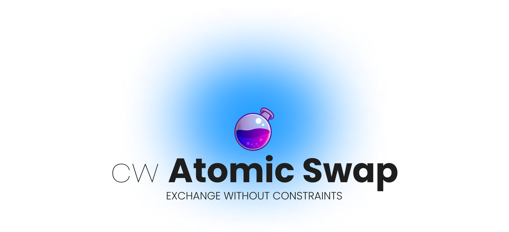

<p align="center" width="100%">
    
    
</p>

`cw-atomic-swap` is a simplified implementation of the [ICS-100](https://github.com/cosmos/ibc/tree/main/spec/app/ics-100-atomic-swap) that
allows two users on the same chain to exchange tokens with an implicit agreement on the the relative price of the two swapped assets.
The contract is a simplified version because it is made to work on a single chain and does not allow the execution of trades via IBC. The
system can be viewed as an on-chain Over The Counter (OTC) market.

The particularity of the contract is that instead of escrowing user funds as done in classical automated market maker systems,
it makes use of the `x/authz` module to grant authorization to the contract to send user funds just before executing the token exchange.


## How it works

The process to perform a swap of coins between two users is below described.

#### Create an order

1. The Maker send a message to authorize the contract to execute a
smart contract call on their behalf with the possibility to send coins.
2. `x/authz` store the authorization with the contract as the `grantee` and the Maker as the `granter`.
3. The Maker send a message to `cw-atomic-swap` to create an order.
4. The contract store the order info without requesting tokens to the Maker.

Please, note that (1.) and (3.) can be send with a multi-message transaction.

#### Accept an order

5. The Taker accept an order by sending to the contract the required amount of coins.
6. The contract receives the Taker request to perform the swap and send a message to the
`x/authz` to execute a contract call.
7. `x/authz` send back to the contract a message, along with authorized funds, on behalf of the Maker to
complete the order.
8. The smart contract send the Taker's funds to the Maker
9. The smart contract send the Maker's funds to the Taker.
10. The smart contact update the order status to completed.


The following sequence diagram describes the process of swap order creation and execution:


## Interfaces

This section described the interfaces to interact with the contract.

### Instantiate

The instantiation requires only an optional parameter representing the owner of the contract:

```json
{
    "owner": "osmo1..."
}

```
### Execute

The configuration of the contract can be updated by specifying a new owner:

```json
{
  "update_config": {
    "new_owner": "osmo1..."
  }
}
```

The creation of the order requires to specify:

- `coin_in`: the coin that the maker wants to send.
- `coin_out`: the coin that the maker wants to receive.
- `taker`: an optional parameter to allows only a selected user
to accept the offer.
- `timeout`: the duration in seconds of the offer.

```json
{
  "create_swap_order": {
    "coin_in": {
      { "denom": "uosmo", "amount": "1" },
    },
    "coin_out": {
      { "denom": "uatom", "amount": "1" },
    },
    "taker": null,
    "timeout": 1
  }
}
```

The taker can accept an order by specifying:

- `order_id`: the identifier of the order.
- `maker`: the maker of the order.

```json
{
  "accept_swap_order": {
    "order_id": 0,
    "maker": "osmo1..."
  }
}
```

Once the contract receive the `accept_swap_order` message, it calls into the authz module
which will send, on the behalf of the user the confirmation request specifying:

- `order_id`: the identifier of the order.
- `maker`: the maker of the order.

```json
{
  "confirm_swap_order": {
    "order_id": 0,
    "maker": "osmo1..."
  }
}
```

### Query

Retrieve the contract configuration:

```json
{
    "config": {}
}
```

Retrieve all active orders:

```json
{
  "all_swap_orders": {}
}
```

Retrieve all active orders from a specific maker:

```json
{
  "swap_orders_by_maker": {
    "maker": "osmo1..."
    }
}
```

## Getting Started

These instructions will help you get a copy of the smart contract on your local machine for development and testing purposes.

### Prerequisites

- [CosmWasm](https://github.com/CosmWasm/cosmwasm)
- Rust: [Installation Guide](https://www.rust-lang.org/tools/install)
- Command runner: [just](https://github.com/casey/just)

### Installation

1. Clone the repository and move into project directory:

    ```shell
    git clone https://github.com/0xstepit/cw-atomic-swap.git
    cd cw-atomic-swap
    ```

2. Build the smart contract:

    ```shell
    just optimize
    ```

### Test

Tests are composed of:

1. Unit tests, contained in the file `./src/tests/unit_tests.rs`.
2. Multitest, contained in the folder `./src/tests/multitest`.
3. Test-tube  contained in the folder `./src/tests/testube`. The execution of these tests requires the previous generation
of the optimized `.wasm` file.

The multitest setup uses a simple custom implementation of the `Stargate` trait to allow to return a general success
response of the message execution and a general error to trigger the `reply` entry point of the contract via mock. In this way it has
been possible to tests all `ExecuteMsg` separately.

The test-tube setup, on the other hand, uses the `Authz` structure to implement the `Module` trait of test tube to
tests the smart contract execution against the real chain logic.

```shell
just test
```

### Lint

```shell
just clippy && just fmt
```

### JSON Schema

```shell
just schema
```

## Considerations

`cw-atomic-swap` is a just a proof of concept and this section describes possible improvements and future works:

- Improve the quality of tests. At the moment just basic scenarios and the main contract flow have been tested. Without
test-tube tests, test coverage is $84.4%$.
- Improve storage layout to access an order just through the index using `IndexedMaps or other solutions.
- Allow users to cancel offers.
- Tests if due to the atomicity of the execution the code can be cleaned removing some of the validations.
- Give a sense to the config structure allowing to specify a fee or pause the market.
- Allow users to swap multiple coins.
- Tests a factory pattern to see if instantiating a different market for every token can improve UX.
- Support IBC to implement the full ICS20.

Other TODOs have been left in the contract to mark other possible improvements.

## License

This project is licensed under the MIT License - see the LICENSE file for details.
